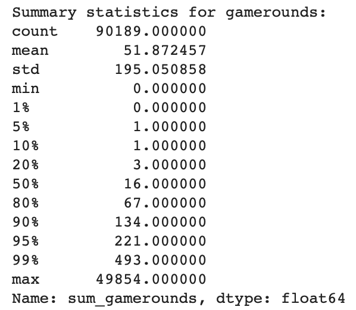
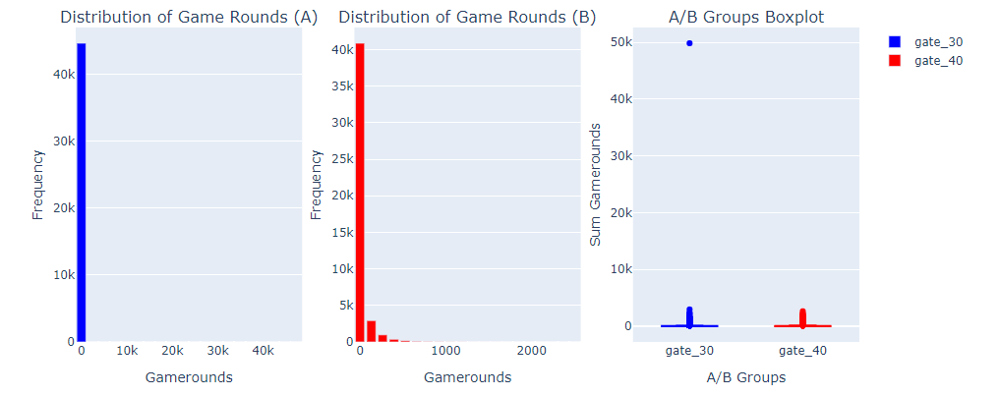
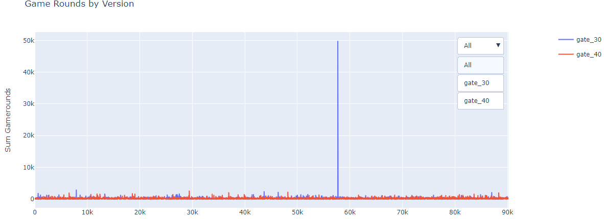
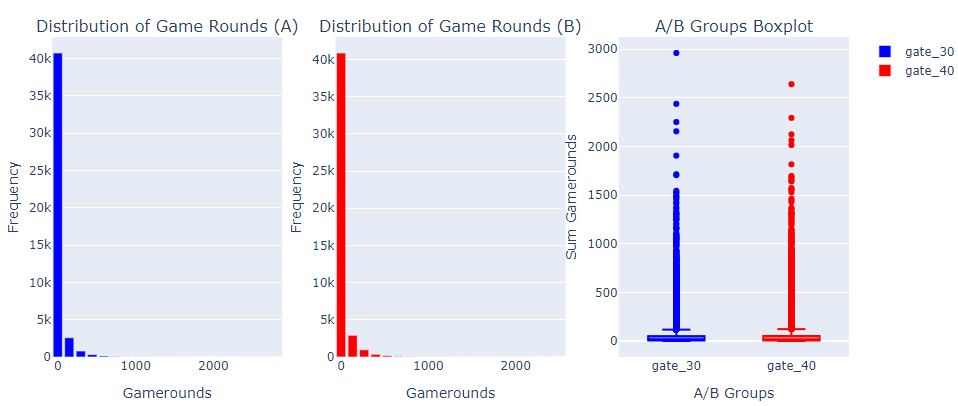
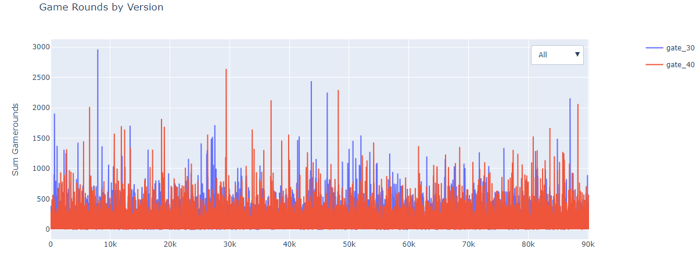
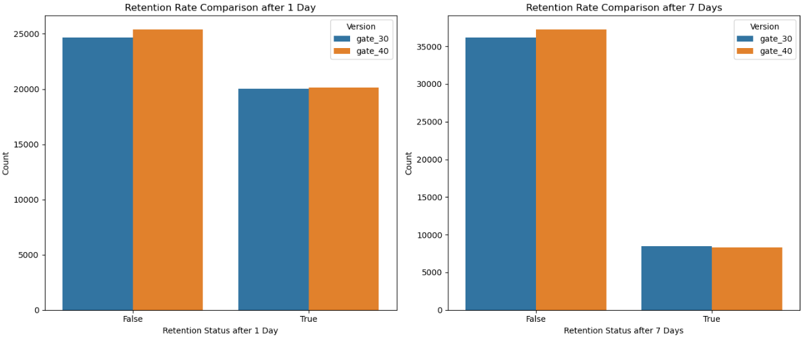
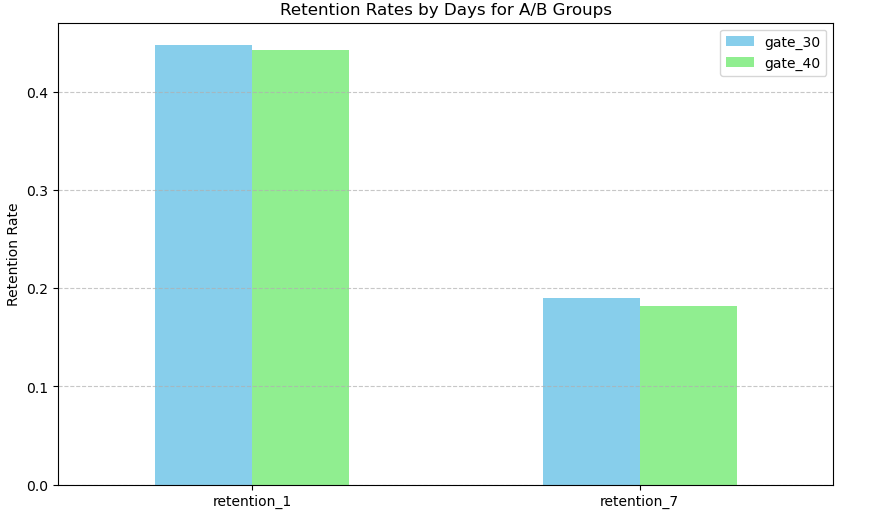
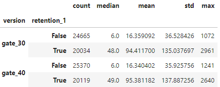
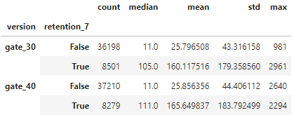

# A/B Testing for Mobile Game Retention

This project involved designing and conducting A/B tests to evaluate the effectiveness of different game features on player retention rates in a mobile game. By segmenting users and analyzing behavioral metrics, the study aimed to identify which variations led to improved engagement and longer play sessions.

## Introduction to A/B Testing

A/B testing, also known as split testing, is a method of comparing two versions of a webpage, app, or product to determine which one performs better. This involves splitting users into two groups: Group A, which uses the original version (control group), and Group B, which uses a modified version (treatment group). The performance of both versions is then measured using key metrics to identify which version yields better results.

### Key Concepts
- Control Group: The group that experiences the original version.
- Treatment Group: The group that experiences the modified version.

## Project Overview

This project aims to conduct an A/B test on a mobile app to evaluate the retention rates of two different versions over a period of one week. Specifically, we are interested in retention on Day 1 and Day 7 after the initial use of the app. The app has been modified to create two different experiences, and we want to determine which version keeps users engaged longer.

### Goals

- Compare Day 1 retention rates between Group A and Group B.
- Compare Day 7 retention rates between Group A and Group B.
- Analyze statistical significance to determine if differences in retention rates are meaningful.

## Data Import and Initial Exploration

1. Setup and Import Libraries

First, ensure you have the required libraries installed. You can do this using pip:

```python
pip install pandas numpy matplotlib plotly seaborn scipy
```

2. Load and Inspect Data

We load the dataset using pandas and perform some initial checks:

- Check Data Types: Ensure each column has the correct data type.
- Check for Duplicates: Verify that there are no duplicate user IDs.
- Check for Negative Values: Ensure there are no negative values in the sum_gamerounds column.
- Check for Missing Values: Confirm that there are no missing values in the dataset.

### Summary of Initial Data Exploration

- Data Types: Confirmed all columns have appropriate data types.
- Duplicate Check: No duplicate user IDs were found.
- Negative Values: No instances with negative game rounds were detected.
- Missing Values: No missing values were found.

## Summary Statistics

Next, we calculate the summary statistics for the sum_gamerounds column to understand the distribution of game rounds played by users.

```python
percentiles = [0.01, 0.05, 0.1, 0.2, 0.5, 0.8, 0.9, 0.95, 0.99]
summary_stats = game_data['sum_gamerounds'].describe(percentiles=percentiles).transpose()

print("Summary statistics for gamerounds:")
print(summary_stats)
```
Output:




### Summary of Summary Statistics
- Count: The dataset contains 90,189 observations.
- Mean: On average, players engage in approximately 51 game rounds.
- Standard Deviation: There is significant variability in game rounds, as indicated by a standard deviation of 195.05 rounds.
- Percentiles:
    - 1% of players engaged in 0 rounds.
    - 5% of players engaged in at least 1 round.
    - 20% of players engaged in 3 or more rounds.
    - 50% (median) of players engaged in 16 rounds.
    - 80% of players engaged in 67 or more rounds.
    - 95% of players engaged in up to 221 rounds.
    - 99% of players engaged in up to 493 rounds.
- Outliers: A few outliers played as many as 49,854 rounds.

## Summary Statistics for Game Rounds Grouped by A/B Groups

The provided summary statistics give us insights into the distribution of game rounds played by users in the control group (gate_30) and the treatment group (gate_40).

```python
group_stats = game_data.groupby("version")['sum_gamerounds'].agg(
    count=lambda x: len(x),
    median=lambda x: np.median(x),
    mean=lambda x: np.mean(x),
    std=lambda x: np.std(x),
    max=lambda x: np.max(x)
).reset_index()

colors = {'gate_30': 'lightblue', 'gate_40': 'lightcoral',}

plt.figure(figsize=(12, 2))
plt.axis('off')
table = plt.table(cellText=group_stats.values,
                  colLabels=group_stats.columns,
                  cellLoc='center',
                  rowLoc='center',
                  loc='center',
                  cellColours=[[colors.get(version, 'lightgrey')] * len(group_stats.columns) for version in group_stats['version']])

table.auto_set_font_size(False)
table.set_fontsize(10)

plt.title("Summary statistics by A/B groups for 'sum_gamerounds'", fontsize=14)

plt.show()
```

Output:


Conclusions:

- Median and Mean: Both groups have similar median and mean values, suggesting that typical user engagement (in terms of game rounds played) is not drastically different between the two versions.

- Variability: The control group (gate_30) shows much higher variability in user engagement. This could be due to a few highly engaged users who play a large number of game rounds, which is reflected in the very high maximum value.

- Outliers: The presence of a user who played 49,854 rounds in the control group (gate_30) significantly impacts the standard deviation and maximum values. Such outliers can skew the data and should be considered when interpreting the results.

## Visualization: Distribution of Game Rounds and A/B Groups Analysis

In this section, we explore the distribution of game rounds played by users across different versions of the game, gate_30 and gate_40. Additionally, we analyze the A/B groups' characteristics using box plots.

- Distribution of Game Rounds (A) and (B)
	- The first two subplots illustrate the distribution of game rounds played by users for gate_30 and gate_40 versions, respectively. Each bar represents the frequency of game rounds within specific bins. The color blue represents gate_30, while red represents gate_40. These visualizations provide insights into the distribution patterns of game rounds for each version.

- A/B Groups Boxplot
	- The third subplot presents box plots for both A/B groups, allowing for a comparative analysis of the game rounds distribution between gate_30 and gate_40. Each box plot displays the distribution of game rounds for a particular version, showing the median, quartiles, and any outliers.

An interesting observation from the box plots is the presence of an extreme outlier in the gate_30 version, where a user played 50,000 game rounds. This outlier is visualized as a data point outside the whiskers of the box plot, indicating its significant deviation from the typical distribution. Such outliers may influence statistical analyses and should be carefully considered in data interpretation.

Let's visualize the distribution of game rounds and A/B groups analysis:
<details>

```python
def create_game_rounds_plot(game_data):
    fig = make_subplots(rows=1, cols=3, subplot_titles=("Distribution of Game Rounds (A)", 
                                                        "Distribution of Game Rounds (B)", 
                                                        "A/B Groups Boxplot"))

    colors = {'gate_30': 'blue', 'gate_40': 'red'}

    # Bar charts for Gate 30 and Gate 40
    for version, subplot in zip(["gate_30", "gate_40"], [1, 2]):
        filtered_data = game_data[game_data.version == version]
        counts, bins = np.histogram(filtered_data.sum_gamerounds, bins=20)
        fig.add_trace(go.Bar(x=bins[:-1], y=counts, marker_color=colors[version], name=version), row=1, col=subplot)

    # Boxplot for A/B groups with the same color as the respective bar chart
    for version in ["gate_30", "gate_40"]:
        filtered_data = game_data[game_data.version == version]
        fig.add_trace(go.Box(x=[version] * len(filtered_data), 
                             y=filtered_data.sum_gamerounds,
                             marker_color=colors[version],
                             boxpoints='outliers',
                             boxmean=False,
                             showlegend=False), 
                      row=1, col=3)

    fig.update_xaxes(title_text="Gamerounds", row=1, col=1)
    fig.update_xaxes(title_text="Gamerounds", row=1, col=2)
    fig.update_xaxes(title_text="A/B Groups", row=1, col=3)

    fig.update_yaxes(title_text="Frequency", row=1, col=1, title_standoff=1)
    fig.update_yaxes(title_text="Frequency", row=1, col=2, title_standoff=1)
    fig.update_yaxes(title_text="Sum Gamerounds", row=1, col=3, title_standoff=1)

    fig.update_layout(height=500,
                      width=1000,
                      showlegend=True)

    return fig
fig = create_game_rounds_plot(game_data)
fig.show()
```
</details>

Output:



## Visualization: Game Rounds by Version

### Function to Create the Plot

The following function creates an interactive plot using Plotly to visualize the number of game rounds played by users, grouped by the version of the app. The plot includes dropdown menus to toggle between different versions or view all versions simultaneously.

<details>

```python
import plotly.graph_objects as go

def create_game_rounds_by_version_plot(game_data):
    traces = []
    for version in game_data['version'].unique():
        filtered_data = game_data[game_data['version'] == version]
        trace = go.Scatter(
            x=filtered_data.index,
            y=filtered_data.sum_gamerounds,
            mode='lines',
            name=version,
            legendgroup=version
        )
        traces.append(trace)

    layout = go.Layout(
        title='Game Rounds by Version',
        xaxis=dict(title='Index'),
        yaxis=dict(title='Sum Gamerounds'),
        legend=dict(x=1.1, y=1),
        updatemenus=[
            dict(
                buttons=[
                    dict(
                        label="All",
                        method="update",
                        args=[{"visible": [True] * len(traces)},
                              {"title": "Game Rounds by Version - All"}]
                    ),
                    *[
                        dict(
                            label=version,
                            method="update",
                            args=[{"visible": [trace.name == version for trace in traces]},
                                  {"title": f"Game Rounds by Version - {version}"}]
                        ) for version in game_data['version'].unique()
                    ]
                ],
                direction="down",
                pad={"r": 10, "t": 10},
                showactive=True,
                x=1,
                xanchor="right",
                y=1,
                yanchor="top"
            )
        ]
    )

    fig = go.Figure(data=traces, layout=layout)
    return fig
```
</details>

Output:


## Handling Outliers in the Dataset

As observed earlier, an extreme outlier significantly affected the summary statistics. To address this issue, we will remove the outlier from the dataset.

### Identifying and Removing the Outlier

First, we filter the data to identify users in the "gate_30" version who played more than 30,000 game rounds. Given that the average number of rounds played by most players is around 51, it's highly improbable that a player would engage in 50,000 rounds, suggesting a potential data entry error rather than a plausible gaming behavior.

#### Code to Identify and Remove the Outlier

<details>
```python
# Filter the data for game rounds greater than 30,000 for "gate_30" version
filtered_data_gate_30 = game_data[(game_data['version'] == 'gate_30') & (game_data['sum_gamerounds'] > 30000)]
print(filtered_data_gate_30)

# Drop the identified outlier from the dataset
game_data.drop(filtered_data_gate_30.index, inplace=True)
</details>
```

### Visualizing the data without extreme outliers

We created functions to generate plotly graphs earlier, we will use the same graph with the cleaned dataset:

```python
fig = create_game_rounds_plot(game_data)
fig.show()
```
Output:


We can enhance clarity and depth in our visualization by leveraging Plotly's graph function we created earlier:

```python
fig = create_game_rounds_by_version_plot(game_data)
fig.show()
```

Output:


## Retention Rate

The provided code snippet generates two bar plots to compare the retention rates of users in the "gate_30" and "gate_40" versions of the mobile game. These plots help visualize the retention rates after 1 day and 7 days, respectively.

<details>

```python
# Create subplots
fig, axs = plt.subplots(1, 2, figsize=(14, 6))

# Retention Rate Comparison after 1 Day
sns.countplot(x='retention_1', hue='version', data=game_data, ax=axs[0])
axs[0].set_title('Retention Rate Comparison after 1 Day')
axs[0].set_xlabel('Retention Status after 1 Day')
axs[0].set_ylabel('Count')
axs[0].legend(title='Version')

# Retention Rate Comparison after 7 Days
sns.countplot(x='retention_7', hue='version', data=game_data, ax=axs[1])
axs[1].set_title('Retention Rate Comparison after 7 Days')
axs[1].set_xlabel('Retention Status after 7 Days')
axs[1].set_ylabel('Count')
axs[1].legend(title='Version')

# Adjust layout
plt.tight_layout()
plt.show()
```
</details>

Output:


Output Summary Interpretation:

1. Day 1 Retention:

- Both versions have a comparable number of users returning after 1 day (around 20,000), with the gate_40 version showing a slight edge.
- More users in the gate_40 version did not return after 1 day compared to the gate_30 version.

2. Day 7 Retention:

- Both versions have a comparable number of users returning after 7 days (around 8,000), with the gate_30 version showing a slight edge.
- A larger number of users in the gate_40 version did not return after 7 days compared to the gate_30 version.

## Retention Metrics

The provided code calculates key retention metrics and visualizes them in a table. Here's an explanation of the code, the resulting metrics, and their interpretation.

```python
# Calculate retention metrics
metrics = {
    "RET1_COUNT": game_data["retention_1"].value_counts(),
    "RET7_COUNT": game_data["retention_7"].value_counts(),
    "RET1_RATIO": game_data["retention_1"].value_counts() / len(game_data),
    "RET7_RATIO": game_data["retention_7"].value_counts() / len(game_data)
}

# Create a DataFrame from the metrics
result_df = pd.DataFrame(metrics)

# Plot the retention metrics table
plt.figure(figsize=(12, 2))
plt.axis('off')
table = plt.table(cellText=result_df.values,
                  colLabels=result_df.columns,
                  rowLabels=result_df.index,
                  cellLoc='center',
                  rowLoc='center',
                  loc='center')

table.auto_set_font_size(False)
table.set_fontsize(10)

plt.title("Retention Rates", fontsize=25, y=0.7)
plt.show()
```

Output:


### Detailed Interpretation

1. Retention after 1 Day (RET1):

- Count:
	- False: 50,035 users did not return after 1 day.
	- True: 40,153 users returned after 1 day.
- Ratio:
	- False: 55.48% of users did not return after 1 day.
	- True: 44.52% of users returned after 1 day.

2. Retention after 7 Days (RET7):

- Count:
	- False: 73,408 users did not return after 7 days.
	- True: 16,780 users returned after 7 days.
- Ratio:
	- False: 81.39% of users did not return after 7 days.
	- True: 18.61% of users returned after 7 days.


### Interpretation Summary

- Day 1 Retention: Approximately 44.52% of users returned after 1 day, indicating a fairly high level of initial engagement.
- Day 7 Retention: The retention rate drops significantly by day 7, with only 18.61% of users returning. This decline is typical in mobile gaming, where user engagement tends to decrease over time.

### Retention Rate Comparison between A/B Groups

This section analyzes the retention rates after 1 day and 7 days for the two A/B groups (gate_30 and gate_40) using a grouped bar chart visualization.

<details>

```python
retention_by_group = game_data.groupby("version")[["retention_1", "retention_7"]].mean()
retention_by_group_transposed = retention_by_group.T

retention_by_group_transposed.plot(kind='bar', figsize=(10, 6), color=['skyblue', 'lightgreen'])
plt.title("Retention Rates by Days for A/B Groups")
plt.xlabel("Retention Days")
plt.ylabel("Retention Rate")
plt.xticks(rotation=0)
plt.legend(["gate_30", "gate_40"])
plt.grid(axis='y', linestyle='--', alpha=0.7)
plt.show()
```

</details>



Visualizing the retention rates after 1 day and 7 days for the two A/B groups (gate_30 and gate_40), the grouped bar chart demonstrates that the gate_30 version consistently exhibits higher retention rates compared to gate_40. Specifically, after 7 days, gate_30 maintains a noticeably higher proportion of users returning to the game, indicating stronger user engagement and retention in the gate_30 group.

## Retention Analysis for Week-1

This section examines the game rounds played by users in the first week after installation, categorized by retention status (retained or not retained) and A/B group (gate_30 or gate_40).

### Data Analysis

Code snippet:
```python
game_data.groupby(["version", "retention_1"]).sum_gamerounds.agg(["count", "median", "mean", "std", "max"])
```
Output:


Observations:

- Retention vs. Non-Retention:

	- Retained users in both gate_30 and gate_40 versions played significantly more game rounds compared to non-retained users.
	- Median and mean game rounds played by retained users were substantially higher than those of non-retained users, indicating a strong association between retention and user engagement.
	
- Comparison between A/B Groups:

	- There is a slight variation in the median and mean game rounds played between gate_30 and gate_40 versions for both retained and non-retained users.
	- However, the difference is relatively small, suggesting that the modification introduced in gate_40 did not have a significant impact on user engagement during the first week.

## Retention Analysis for Week-7

Code snippet:
```python
game_data.groupby(["version", "retention_7"]).sum_gamerounds.agg(["count", "median", "mean", "std", "max"])
```
Output:


Observations:

- Again, there is a slight variation in the median and mean game rounds played between gate_30 and gate_40 versions for both retained and non-retained users.
- However, the difference is relatively small, **suggesting that the modification introduced in gate_40 did not have a significant impact on user engagement even after 7 weeks.**

## A/B Testing: Analyzing Game Rounds Played

This section conducts an A/B test to compare the game rounds played between two A/B groups (gate_30 and gate_40) using the function perform_ab_test().

### Function Overview
The perform_ab_test() function conducts the following steps:

1. Data Preparation:
	- Splits the data into two groups: Group A (gate_30) and Group B (gate_40).
2. Normality Check:
	- Assesses the normality assumption of the data using the Shapiro-Wilk test for both groups.
3. Test Selection:
	- Based on the normality assessment:
		- If both groups follow a normal distribution, a parametric test (t-test) is performed.
		- If not, a non-parametric test (Mann-Whitney U test) is conducted.
4. Effect Size Calculation:
	- Calculates the effect size (Cohen's d) to quantify the magnitude of the difference between the two groups.
5. Interpretation:
	- Determines whether to reject or fail to reject the null hypothesis based on the p-value (significance level α).
	- Provides a comment indicating whether the A/B groups are similar or not.
6. Visual Representation:
	- Presents the test results in a table format for easy interpretation.

Code snippet:
```python
def perform_ab_test(data, group_col, target_col, alpha=0.05, effect_size=None, power=None):
    # Splitting A/B groups
    group_a = data[data[group_col] == "gate_30"][target_col]
    group_b = data[data[group_col] == "gate_40"][target_col]
    
    # Checking normality assumption using Shapiro-Wilk test
    normality_a = shapiro(group_a)[1] >= alpha
    normality_b = shapiro(group_b)[1] >= alpha
    
    # Perform t-test or Mann-Whitney U test based on normality
    if normality_a and normality_b:
        # Parametric test (t-test)
        test_stat, p_value = ttest_ind(group_a, group_b)
        test_type = "Parametric (t-test)"
    else:
        # Non-parametric test (Mann-Whitney U test)
        test_stat, p_value = mannwhitneyu(group_a, group_b)
        test_type = "Non-parametric (Mann-Whitney U)"
    
    # Calculate effect size (Cohen's d)
    if effect_size is None:
        if normality_a and normality_b:
            pooled_std = np.sqrt((np.var(group_a) + np.var(group_b)) / 2)
            effect_size = (group_a.mean() - group_b.mean()) / pooled_std
        else:
            # Use rank-biserial correlation as effect size for non-parametric test
            effect_size = 2 * test_stat / len(data)
    
    # Interpretation of results
    hypothesis = "Reject H0" if p_value < alpha else "Fail to Reject H0"
    comment = "A/B groups are not similar!" if hypothesis == "Reject H0" else "A/B groups are similar!"
    
    result_df = pd.DataFrame({
        "Test Type": [test_type],
        "AB Hypothesis": [hypothesis],
        "p-value": [p_value],
        "Effect Size (Cohen's d)": [effect_size],
        "Comment": [comment]
    })
    
    plt.figure(figsize=(12, 1))
    plt.axis('off')
    table = plt.table(cellText=result_df.values,
                      colLabels=result_df.columns,
                      cellLoc='center',
                      rowLoc='center',
                      loc='center')

    table.auto_set_font_size(False)
    table.set_fontsize(7)

    plt.title("A/B Test Results", fontsize=25, y=0.7)
    plt.show()

    return ""

perform_ab_test(data=game_data, group_col="version", target_col="sum_gamerounds")
```
Output:


Interpretation:

- Test Type: The test conducted is Non-parametric (Mann-Whitney U).
- AB Hypothesis: The null hypothesis is "Fail to Reject H0", indicating that there is no significant difference in the average game rounds played between the gate_30 and gate_40 groups.
- p-value: The p-value obtained from the test is 0.05089, which is higher than the significance level (α = 0.05). This suggests that there is insufficient evidence to reject the null hypothesis.
- Effect Size (Cohen's d): The effect size calculated (Cohen's d = 22714.45) indicates a large magnitude of difference between the two groups.

Conclusion:

The A/B test results suggest that the modifications introduced in the gate_40 version do not have a significant impact on user engagement (game rounds played) compared to the baseline gate_30 version.

## A/B Testing for Player Retention at Week 1 and Week 7

In this section, we conduct A/B testing to scrutinize the performance of two player groups at different retention intervals: Week 1 and Week 7. Specifically, we split the player population into two distinct segments for each retention interval:

1. Week 1 Retention:
- Group A: Players retained at Week 1 for gate_30 version.
- Group B: Players retained at Week 1 for gate_40 version.

2. Week 7 Retention:
- Group A: Players retained at Week 7 for gate_30 version.
- Group B: Players retained at Week 7 for gate_40 version.

Our objective is to discern any substantial discrepancies between these groups concerning their engagement levels and retention rates at each specific time point.

Let's proceed to examine the A/B test results for retention at Week 1 and Week 7 separately.

Code snippet:

<details>

```python
def perform_ab_test(data, group_col, target_col, retention_day, alpha=0.05, effect_size=None, power=None):
    # Splitting A/B groups
    group_a = data[(data[group_col] == "gate_30") & (data["retention_" + str(retention_day)] == True)][target_col]
    group_b = data[(data[group_col] == "gate_40") & (data["retention_" + str(retention_day)] == True)][target_col]
    
    # Checking normality assumption using Shapiro-Wilk test
    normality_a = shapiro(group_a)[1] >= alpha
    normality_b = shapiro(group_b)[1] >= alpha
    
    # Perform t-test or Mann-Whitney U test based on normality
    if normality_a and normality_b:
        # Parametric test (t-test)
        test_stat, p_value = ttest_ind(group_a, group_b)
        test_type = "Parametric (t-test)"
    else:
        # Non-parametric test (Mann-Whitney U test)
        test_stat, p_value = mannwhitneyu(group_a, group_b)
        test_type = "Non-parametric (Mann-Whitney U)"
    
    # Calculate effect size (Cohen's d)
    if effect_size is None:
        if normality_a and normality_b:
            pooled_std = np.sqrt((np.var(group_a) + np.var(group_b)) / 2)
            effect_size = (group_a.mean() - group_b.mean()) / pooled_std
        else:
            # Use rank-biserial correlation as effect size for non-parametric test
            effect_size = 2 * test_stat / len(data)
    
    # Interpretation of results
    hypothesis = "Reject H0" if p_value < alpha else "Fail to Reject H0"
    comment = "A/B groups are not similar!" if hypothesis == "Reject H0" else "A/B groups are similar!"
    
    result_df = pd.DataFrame({
        "Test Type": [test_type],
        "AB Hypothesis": [hypothesis],
        "p-value": [p_value],
        "Effect Size (Cohen's d)": [effect_size],
        "Comment": [comment]
    })
    
    plt.figure(figsize=(12, 1))
    plt.axis('off')
    table = plt.table(cellText=result_df.values,
                      colLabels=result_df.columns,
                      cellLoc='center',
                      rowLoc='center',
                      loc='center')

    table.auto_set_font_size(False)
    table.set_fontsize(7)

    plt.title("A/B Test Results for Retention " + str(retention_day), fontsize=25, y=0.7)
    plt.show()

    return " "

perform_ab_test(data=game_data, group_col="version", target_col="sum_gamerounds", retention_day=1)
perform_ab_test(data=game_data, group_col="version", target_col="sum_gamerounds", retention_day=7)
```
</details>

Output:


### A/B Test Results for Retention Week 1

Based on the p-value of 0.70, we fail to reject the null hypothesis (H0), indicating that there is no significant difference in player retention between the gate_30 and gate_40 versions at Week 1. This suggests that both versions perform similarly in retaining players during the initial phase of the game.

### A/B Test Results for Retention Week 7

With a p-value of 0.01, we reject the null hypothesis (H0), indicating a significant difference in player retention between the gate_30 and gate_40 versions at Week 7. The effect size (Cohen's d) of 762.46 further emphasizes this difference. This suggests that the gate_30 version exhibits a notably different retention pattern compared to the gate_40 version at this stage, indicating potential differences in player engagement and behavior over time.


**NOTE:**
In the case of Week 1 retention, despite the high Cohen's d of 4459, the high p-value of 0.70 suggests that the observed difference in retention between the gate_30 and gate_40 versions may be due to random variability rather than a meaningful difference. Therefore, while there may be a large effect size, the lack of statistical significance implies that the observed difference in retention at Week 1 is not practically meaningful.

Conversely, for Week 7 retention, the low p-value of 0.01, along with the high Cohen's d of 762.46, indicates a significant difference in retention between the two versions. This suggests that the observed difference in retention at Week 7 is both statistically and practically meaningful, with the effect size contributing to the significance of the findings.

In summary, while Cohen's d provides insight into the magnitude of group differences, it must be interpreted in conjunction with the p-value to determine the practical significance and statistical validity of the observed differences.


